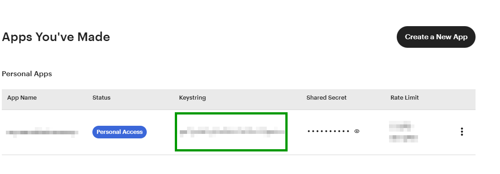

# Integrating the Etsy Provider

Etsy's OAuth implementation uses Authorization Code with PKCE and issues refresh tokens. This provider enables PKCE by default and validates scopes to match Etsy's requirements.

- [Integrating the Etsy Provider](#integrating-the-etsy-provider)
  - [Quick Links](#quick-links)
  - [Quick start](#quick-start)
    - [Minimal configuration](#minimal-configuration)
  - [Required Additional Settings](#required-additional-settings)
  - [Optional Settings](#optional-settings)
    - [Scope constants](#scope-constants)
  - [Refreshing tokens](#refreshing-tokens)
  - [Claims](#claims)
    - [Basic User Information claims](#basic-user-information-claims)
    - [Detailed User Information claims](#detailed-user-information-claims)
      - [Automapped claims](#automapped-claims)
      - [Manually Added Claims](#manually-added-claims)
  - [Advanced Configuration](#advanced-configuration)
  - [Accessing claims (Minimal API Sample)](#accessing-claims-minimal-api-sample)
    - [Minimalistic directly in Program.cs](#minimalistic-directly-in-programcs)
    - [Extended in a Feature-style Minimal API with endpoints using MapGroup](#extended-in-a-feature-style-minimal-api-with-endpoints-using-mapgroup)
      - [Define record types for Typed Results](#define-record-types-for-typed-results)
      - [Extension class anywhere in your project](#extension-class-anywhere-in-your-project)
      - [Register the endpoints in Program.cs](#register-the-endpoints-in-programcs)

## Quick Links

- Register your App at [Apps You've Made](https://www.etsy.com/developers/your-apps) on Etsy.
- Official Etsy Authentication API Documentation: [Etsy Developer Documentation](https://developers.etsy.com/documentation/essentials/authentication)
- Requesting a Refresh OAuth Token: [Etsy Refresh Token Guide](https://developers.etsy.com/documentation/essentials/authentication#requesting-a-refresh-oauth-token)
- Etsy API Reference: [Etsy API Reference](https://developers.etsy.com/documentation/reference)

## Quick start

```csharp
using AspNet.Security.OAuth.Etsy;
using Microsoft.AspNetCore.Authentication;
using Microsoft.AspNetCore.Authentication.Cookies;

var builder = WebApplication.CreateBuilder(args);

builder.Services
  .AddAuthentication(options =>
  {
    options.DefaultScheme = CookieAuthenticationDefaults.AuthenticationScheme;
    options.DefaultChallengeScheme = EtsyAuthenticationDefaults.AuthenticationScheme;
  })
  .AddCookie()
  .AddEtsy(options =>
  {
    options.ClientId = builder.Configuration["Etsy:ClientId"]!;
  });

var app = builder.Build();

app.UseAuthentication();
app.UseAuthorization();

// Route to start the Etsy OAuth flow (challenge)
app.MapGet("/signin/etsy", (HttpContext ctx, string? returnUrl) =>
  Results.Challenge(new AuthenticationProperties
  {
    RedirectUri = returnUrl ?? "/"
  }, new[] { EtsyAuthenticationDefaults.AuthenticationScheme }));

// NOTE: The callback path '/signin-etsy' is handled automatically by the middleware.
// Do NOT map a route for it unless you change CallbackPath in options.

app.Run();
```

### Minimal configuration

**In your appsettings.json or appsettings.Development.json file:**

```json
{
  "Etsy": {
    "ClientId": "your-etsy-api-key"
  }
}
```

**In your `Program.cs` or `Startup.cs` file:**

```csharp
builder.Services.Configure<EtsyAuthenticationOptions>(
    builder.Configuration.GetSection("Etsy"));
```

## Required Additional Settings

- `ClientId` is required.

  You can obtain it by registering your application on [Etsy's developer portal](https://www.etsy.com/developers/your-apps).

  It will be stated as `keystring` in your app settings:

  

> [!NOTE]
>
> - ClientSecret is optional for public clients using PKCE.
> - When `IncludeDetailedUserInfo` is enabled, `email_r` scope and standard claims are auto-mapped.
> - The `EtsyAuthenticationConstants.Claims.ImageUrl` claim must be [added if needed](#manually-added-claims).

## Optional Settings

| Property Name | Property Type | Description | Default Value |
|:--:|:--:|:--:|:--:|
| `Scope` | `ICollection<string>` | Scopes to request. Use `EtsyAuthenticationConstants.Scopes.*` constants. | `["shops_r"]` |
| `IncludeDetailedUserInfo` | `bool` | Fetch extended profile data with auto-mapped claims (Email, GivenName, Surname). | `false` |
| `UsePkce` | `bool` | Enable PKCE (required by Etsy). | `true` |
| `SaveTokens` | `bool` | Persist access and refresh tokens. | `true` |
| `CallbackPath` | `PathString` | The request path within your application where the user-agent will be returned after Etsy has authenticated the user. | `/signin-etsy` |
| `DetailedUserInfoEndpoint` | `string` | The endpoint to retrieve detailed user information. | `https://openapi.etsy.com/v3/application/users/{0}` |

> [!NOTE]
> The `DetailedUserInfoEndpoint` uses `{0}` as a placeholder for the `user_id`. It's replaced automatically when fetching detailed user info.

### Scope constants

Use `EtsyAuthenticationConstants.Scopes.*` instead of string literals. Common values:

| Constant | Scope Value |
|:--|:--|
| `EmailRead` | `email_r` |
| `ListingsRead` | `listings_r` |
| `ListingsWrite` | `listings_w` |
| `ShopsRead` | `shops_r` |
| `TransactionsRead` | `transactions_r` |

## Refreshing tokens

This provider saves tokens by default (`SaveTokens = true`). Etsy issues a refresh token; you are responsible for performing the refresh flow using the saved token when the access token expires.

```csharp
var refreshToken = await HttpContext.GetTokenAsync("refresh_token");
```

See [Requesting a Refresh OAuth Token](#quick-links) in the Quick Links above for the HTTP details.

## Claims

### Basic User Information claims

**Endpoint:** [`/v3/application/users/me` `getMe`](https://developers.etsy.com/documentation/reference#operation/getMe)

| Claim Type | Value Source | Description |
|:--|:--:|:--:|
| `http://schemas.xmlsoap.org/ws/2005/05/identity/claims/nameidentifier` | `user_id` | Primary user identifier |
| `urn:etsy:shop_id` | `shop_id` | User's shop ID |

### Detailed User Information claims

Endpoint: [`/v3/application/users/{user_id}` `getUser`](https://developers.etsy.com/documentation/reference#operation/getUser)

#### Automapped claims

_Requires `EtsyAuthenticationOptions.IncludeDetailedUserInfo = true`_

| Claim Type | JSON Key | Auto-mapped |
|:--|:--:|:--:|
| `http://schemas.xmlsoap.org/ws/2005/05/identity/claims/emailaddress` | `primary_email` | ✓ |
| `http://schemas.xmlsoap.org/ws/2005/05/identity/claims/givenname` | `first_name` | ✓ |
| `http://schemas.xmlsoap.org/ws/2005/05/identity/claims/surname` | `last_name` | ✓ |
| `urn:etsy:image_url` | `image_url_75x75` | [Manual](#manually-added-claims) |

> [!WARNING]
> As those claims are set in Provider side `PostConfigureOptions`, you have to include them yourself if you bind from `PostConfigure<EtsyAuthenticationOptions>` also.

#### Manually Added Claims

The `image_url_75x75` claim is not auto-mapped to reduce data bloat. You can add it manually via either:

**Direct JSON key mapping:**

This sample does also work for regular JSON key mapping:

```csharp
options.ClaimActions.MapJsonKey(EtsyAuthenticationConstants.Claims.ImageUrl, "image_url_75x75");
```

**Claim Image using predefined extension method:**

```csharp
options.ClaimActions.MapImageClaim();
```

## Advanced Configuration

The Etsy authentication handler can be configured in code or via configuration files.

> [!NOTE]
> Always make sure to use proper [Secret Management for production applications](https://learn.microsoft.com/aspnet/core/security/app-secrets).

You can keep using code-based configuration, or bind from configuration values.

> [!WARNING]
> Avoid setting `UsePkce` from configuration, as Etsy requires PKCE for all OAuth flows.

Here is a comprehensive `appsettings.json` example covering supported options and common scopes:

```json
{
  "Etsy": {
    "ClientId": "your-etsy-api-key",
    "IncludeDetailedUserInfo": true,
    "DetailedUserInfoEndpoint": "https://openapi.etsy.com/v3/application/users/{0}",
    "AuthorizationEndpoint": "https://www.etsy.com/oauth/connect",
    "TokenEndpoint": "https://openapi.etsy.com/v3/public/oauth/token",
    "UserInformationEndpoint": "https://openapi.etsy.com/v3/application/users/me",
    "CallbackPath": "/signin/etsy",
    "SaveTokens": true,
    "Scopes": [ "shops_r", "email_r" ]
  }
}
```

> [!NOTE]
> We recommend saving tokens (`SaveTokens = true`) to facilitate token refresh, so the user does not need to re-authenticate frequently.
> [!NOTE]
> If `IncludeDetailedUserInfo` is set to `true` and the scopes `shops_r` and `email_r` scopes are sufficient, you don't need to set additional scopes in `appsettings.json`, they are added automatically.
> [!TIP]
> We recommend using the `EtsyAuthenticationDefaults` class in your `.AddEtsy` call which contains the default endpoint URLs.

If you bind then from configuration, set the options in code, for example:

```csharp
builder.Services.AddAuthentication(options =>
{
    options.DefaultScheme = CookieAuthenticationDefaults.AuthenticationScheme;
    // If you only have Etsy as external provider you can apply it as default challenge scheme
    options.DefaultChallengeScheme = EtsyAuthenticationDefaults.AuthenticationScheme;
})
.AddCookie(options =>
{
    options.LoginPath = "/signin";
    options.LogoutPath = "/signout";
})
.AddEtsy(options =>
{
    var section = builder.Configuration.GetSection("Etsy").Get<EtsyAuthenticationOptions>()!;
    if (section is not EtsyAuthenticationOptions
      // Check if the values from appsettings.json has been properly overridden
     || section.ClientId is "client-id-from-user-secrets")
    {
        throw new InvalidOperationException("Etsy configuration section is missing or invalid.");
    }

    options.ClientId = section.ClientId;
    // Optional: The Etsy App registration provides the `Shared Secret` but it's not documented to be used/required for PKCE flows.
    options.ClientSecret = section.ClientSecret;
    // Optional: Include detailed user info and auto-mapped claims to get e.g. email, first and last name
    options.IncludeDetailedUserInfo = section.IncludeDetailedUserInfo;

    // Optional: Override the defaults from EtsyAuthenticationDefaults with your own values (not recommended! Will potentially break the handler)
    // Here we just re-assign the defaults for demonstration
    options.AuthorizationEndpoint = EtsyAuthenticationDefaults.AuthorizationEndpoint;
    options.TokenEndpoint = EtsyAuthenticationDefaults.TokenEndpoint;
    options.UserInformationEndpoint = EtsyAuthenticationDefaults.UserInformationEndpoint;

    // Optional: Override SaveTokens setting from configuration (not recommended to disable! as Etsy API uses refresh tokens)
    options.SaveTokens = section.SaveTokens;

    // Optional: Add scopes from configuration
    foreach (var scope in section.Scopes)
    {
        options.Scope.Add(scope);
    }

    // Optional: Or add scopes manually with provided constants
    options.Scope.Add(EtsyAuthenticationConstants.Scopes.TransactionsRead);

    // Optional: Map the image claim
    options.ClaimActions.MapImageClaim();

    // Map other Claims
    options.ClaimActions.MapJsonKey("urn:etsy:listingsWrite", EtsyAuthenticationConstants.Claims.ListingsWrite);
})
```

## Accessing claims (Minimal API Sample)

If you want to access the claims provided by the Etsy provider, you can set up some Minimal API endpoints like this:

### Minimalistic directly in Program.cs

```csharp
using AspNet.Security.OAuth.Etsy;
using System.Security.Claims;

app.MapGet("/etsy/profile", (ClaimsPrincipal user) =>
{
  var userId = user.FindFirstValue(ClaimTypes.NameIdentifier);
  var shopId = user.FindFirstValue(EtsyAuthenticationConstants.Claims.ShopId);
  var email = user.FindFirstValue(ClaimTypes.Email);
  var firstName = user.FindFirstValue(ClaimTypes.GivenName);
  var lastName = user.FindFirstValue(ClaimTypes.Surname);
  var imageUrl = user.FindFirstValue(EtsyAuthenticationConstants.Claims.ImageUrl);

  return Results.Ok(new { userId, shopId, email, firstName, lastName, imageUrl });
})
.RequireAuthorization()
.WithName("EtsyProfile")
.WithSummary("Get authenticated user's Etsy profile information");
```

### Extended in a Feature-style Minimal API with endpoints using MapGroup

This sample assumes you not only have Etsy as external provider and use cookie authentication for session management.

#### Define record types for Typed Results

Before we can start, we need some record types to hold the user profile and token information.

The following ones are created from the json-objects returned by Etsy's API.

```csharp
public sealed record UserInfo
{
  public required string UserId { get; init; }
  public required string ShopId { get; init; }
  public string? Email { get; init; }
  public string? FirstName { get; init; }
  public string? LastName { get; init; }
  public string? ImageUrl { get; init; }
}

public sealed record TokenInfo
{
  public string? AccessToken { get; init; }
  public string? RefreshToken { get; init; }
  public string? ExpiresAt { get; init; }
}
```

> [!NOTE]
> Make sure to add proper JSON serialization attributes if you use System.Text.Json or Newtonsoft.Json to serialize those records to JSON in the HTTP responses.

#### Extension class anywhere in your project

```csharp
using AspNet.Security.OAuth.Etsy;
using Microsoft.AspNetCore.Authentication;
using Microsoft.AspNetCore.Authentication.Cookies;
using Microsoft.AspNetCore.Http.HttpResults;
using System.Security.Claims;

namespace MyApi.Features.Authorization;

public static class EtsyAuthEndpoints
{
  public static IEndpointRouteBuilder MapEtsyAuth(this IEndpointRouteBuilder app)
  {
    var group = app.MapGroup("/etsy")
      .WithTags("Etsy Authentication");

    // Sign-in: triggers the Etsy OAuth handler
    group.MapGet("/signin", SignInAsync)
      .WithName("EtsySignIn")
      .WithSummary("Initiate Etsy OAuth authentication");

    // Sign-out: removes the auth cookie/session
    group.MapGet("/signout", SignOutAsync)
      .WithName("EtsySignOut")
      .WithSummary("Sign out from Etsy authentication");

    // Protected: returns the authenticated user's profile
    group.MapGet("/user-info", GetProfileAsync)
      .RequireAuthorization()
      .WithName("User Info")
      .WithSummary("Get authenticated user's information");

    // Protected: returns saved OAuth tokens
    group.MapGet("/tokens", GetTokensAsync)
      .RequireAuthorization()
      .WithName("EtsyTokens")
      .WithSummary("Get OAuth access and refresh tokens");

    return app;
  }

  private static Results<ChallengeHttpResult, RedirectHttpResult> SignInAsync(string? returnUrl)
    => TypedResults.Challenge(
      new AuthenticationProperties { RedirectUri = returnUrl ?? "/" }, EtsyAuthenticationDefaults.AuthenticationScheme);

  private static async Task<RedirectHttpResult> SignOutAsync(HttpContext context)
  {
    await context.SignOutAsync(new AuthenticationProperties { RedirectUri = "/" }, CookieAuthenticationDefaults.AuthenticationScheme);
    return TypedResults.Redirect("/");
  }

  private static Task<Ok<UserInfo>> GetProfileAsync(ClaimsPrincipal user)
  {
    var profile = new UserInfo
    {
      UserId = user.FindFirstValue(ClaimTypes.NameIdentifier)!,
      ShopId = user.FindFirstValue(EtsyAuthenticationConstants.Claims.ShopId)!,
      Email = user.FindFirstValue(ClaimTypes.Email),
      FirstName = user.FindFirstValue(ClaimTypes.GivenName),
      LastName = user.FindFirstValue(ClaimTypes.Surname),
      ImageUrl = user.FindFirstValue(EtsyAuthenticationConstants.Claims.ImageUrl)
    };

    return Task.FromResult(TypedResults.Ok(profile));
  }

  private static async Task<Ok<TokenInfo>> GetTokensAsync(HttpContext context)
  {
    var tokenInfo = new TokenInfo
    {
      AccessToken = await context.GetTokenAsync("access_token"),
      RefreshToken = await context.GetTokenAsync("refresh_token"),
      ExpiresAt = await context.GetTokenAsync("expires_at")
    };

    return TypedResults.Ok(tokenInfo);
  }
}
```

#### Register the endpoints in Program.cs

Now that we have defined the extension method to map the Etsy authentication endpoints, we need to register them in our `Program.cs` file.

```csharp
using MyApi.Features.Authorization;
app.MapEtsyAuth();
```
